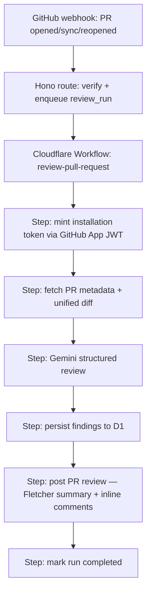

# Development Plan: The Fletcher Review Bot

Turn `not-quite-my-tempo` from a webhook-to-fake-review skeleton into a
production code review bot that reviews pull requests with the Gemini API and
delivers feedback in the voice of Terence Fletcher from _Whiplash_ — exacting,
theatrical, and obsessed with precision. Not quite my tempo.

## Where we are today

The plumbing already works end to end:

- `POST /webhooks/github` verifies HMAC signatures, decodes `pull_request`
  `opened` / `synchronize` / `reopened` payloads, upserts installation +
  repository, and creates an idempotent `review_runs` row per
  (repository, PR number, head SHA) — `apps/api/src/github/webhook.ts`,
  `apps/api/src/application/review-requests.ts`.
- A Cloudflare Workflow (`review-pull-request`) marks the run running →
  completed, but the review itself is `performFakeReview()` — a stub in
  `apps/api/src/application/review-workflow.ts`.
- D1 schema already anticipates the real product: `review_runs` has `model`,
  error columns, and status transitions; `findings` has `file_path`, `line`,
  `severity`, `category`, `confidence`, `title`, `message`, and
  `github_comment_id` — `packages/db/src/schema/`.

What's missing: GitHub App authentication, fetching the PR diff, calling
Gemini, persisting findings, and posting review comments back to GitHub.

## Target architecture



Each Workflow step is durable and retried independently, which is exactly what
we want around flaky external calls (GitHub API, Gemini API).

---

## Phase 1 — GitHub App authentication

The bot must act _as the GitHub App installation_ to read diffs and post
reviews. Webhook receipt already records `installation.id`; now use it.

Tasks:

1. New secrets: `GITHUB_APP_ID` and `GITHUB_APP_PRIVATE_KEY` (PKCS#8 PEM).
   Add to `apps/api/.dev.vars` locally, `wrangler secret put` in prod, and
   document both in `.env.example` and the README (per repo rules, same
   change).
2. New module `apps/api/src/github/app-auth.ts`:
   - Sign a short-lived RS256 App JWT with WebCrypto
     (`crypto.subtle.importKey` + `sign`) — no Node-only crypto; must run in
     workerd. Avoid heavyweight Octokit; a fetch-based client keeps the
     Worker lean.
   - Exchange it at `POST /app/installations/{id}/access_tokens` for an
     installation token (valid 1 hour — mint per Workflow run, don't cache
     in Phase 1).
   - Model as an Effect service (`GitHubAppAuth` `Context.Tag`) with tagged
     errors (`GitHubAuthError`), matching the existing service style in
     `packages/db/src/services/`.
3. Thread `installationId` into `ReviewWorkflowParams` (it's already on
   `ReviewRequest`, verify it survives into the Workflow payload).

Acceptance: a Workflow step can mint a token for the test installation, with
unit tests covering JWT claims (iat skew, exp ≤ 10 min, iss = app id).

## Phase 2 — Fetch the PR diff

New module `apps/api/src/github/pull-request-client.ts` (Effect service
`GitHubPullRequestClient`):

1. `GET /repos/{owner}/{repo}/pulls/{number}` with
   `Accept: application/vnd.github.diff` for the unified diff, plus a JSON
   fetch for title/body/base info.
2. Guardrails before we ever hit Gemini:
   - Skip generated/lockfiles (`pnpm-lock.yaml`, `*.min.js`, `drizzle/*.sql`
     snapshots, etc.) via a default ignore list.
   - Cap diff size (~300 KB to start). Oversized PRs get a single Fletcher
     summary comment ("I can't conduct a band this size…") and the run is
     marked completed with a `skipped_reason`-style error code rather than
     failed.
3. Parse the diff into per-file hunks with line mapping (new-file line
   numbers) so findings can anchor inline comments. Keep the parser small and
   pure — it belongs in `packages/core` with direct unit tests.

Acceptance: given a recorded real-world diff fixture, the parser produces
file/hunk/line structures that round-trip to valid GitHub review comment
positions.

## Phase 3 — Gemini review service

The heart of the bot. New package `packages/gemini` (workspace pattern:
`workspace:*`, `exports` → `src/*.ts`, no build step), keeping it
platform-neutral like `packages/core`.

1. **Transport**: call the REST endpoint
   `https://generativelanguage.googleapis.com/v1beta/models/{model}:generateContent`
   directly with `fetch` — avoids SDK/workerd compatibility risk and keeps
   the dependency graph flat. Secret: `GEMINI_API_KEY` (dev.vars +
   `wrangler secret put` + `.env.example` + README).
2. **Model**: default `gemini-3.8-flash` (GA, 1M context, tuned for
   software-engineering workloads). Make it configurable via optional
   `GEMINI_MODEL` var and record it in `review_runs.model` (column already
   exists — use it).
3. **Structured output**: use Gemini's JSON response schema so output decodes
   directly into an Effect `Schema` mirroring the `findings` table:

   ```ts
   const GeminiFinding = Schema.Struct({
     filePath: Schema.NonEmptyString,
     line: Schema.NullOr(Schema.Number.pipe(Schema.int(), Schema.positive())),
     severity: Schema.Literal("critical", "warning", "suggestion"),
     category: Schema.NullOr(Schema.String),
     confidence: Schema.Number.pipe(Schema.between(0, 1)),
     title: Schema.NonEmptyString,
     message: Schema.NonEmptyString,
   });

   const GeminiReview = Schema.Struct({
     verdict: Schema.Literal("not_my_tempo", "almost", "good_job"),
     summary: Schema.NonEmptyString,
     findings: Schema.Array(GeminiFinding),
   });
   ```

4. **Effect service** `GeminiReviewer` with tagged errors
   (`GeminiApiError`, `GeminiResponseParseError`), timeout via
   `Effect.timeout`, and retry with `Schedule.exponential` on 429/5xx.
   Follow the idioms enforced by the local `anti-slop-effect` oxlint plugin.
5. **The Fletcher system prompt** (`packages/gemini/src/prompt.ts`):
   - Persona: a legendarily demanding conservatory instructor reviewing code
     the way Fletcher rehearses a band. Terse, cutting, impatient with
     sloppiness. Signature phrasing: "not quite my tempo", "were you rushing
     or were you dragging?", "that's not your job" — remixed, not repeated
     verbatim on every finding.
   - **Hard guardrails baked into the prompt**: critique the _code_, never
     the author as a person. No slurs, no personal attacks, no profanity
     beyond mild theatrical exasperation. Every finding must contain a
     concrete, technically correct fix — the persona is seasoning, the
     substance is the review. If the PR is genuinely clean, Fletcher grudgingly
     admits it ("...good job" is the rarest verdict, and he means it).
   - Instructions: only comment on changed lines, prefer few high-signal
     findings over volume, severity honesty (`critical` = correctness/security
     only), confidence calibration.

Acceptance: unit tests with mocked fetch verify request shape, schema
decoding, retry/timeout behavior, and that a malformed model response
produces a typed failure rather than a crash.

## Phase 4 — Wire the Workflow

Replace `performFakeReview()` in
`apps/api/src/application/review-workflow.ts` and expand
`apps/api/src/workflows/review-pull-request.ts` into real durable steps:

1. `mint installation token` → 2. `fetch pull request diff` → 3. `run gemini review` → 4. `persist findings` → 5. `post github review`
   → 6. `mark review run completed`.
2. New repository `packages/db/src/repositories/finding-repository.ts` with
   `insertMany(reviewRunId, findings)` and
   `setGithubCommentId(findingId, commentId)`.
3. Persist findings _before_ posting to GitHub so a failed post can be
   retried by the Workflow step without re-running Gemini (steps are memoized
   by name — this is the point of the step boundaries).
4. Failure taxonomy in `review_runs.error_code`: `github_auth_error`,
   `diff_fetch_error`, `gemini_error`, `post_review_error`,
   `diff_too_large` — so ops queries stay one `SELECT` away.
5. Keep structured logging parity with the existing
   `review_workflow_started/completed/failed` events; add per-step timing
   fields.

## Phase 5 — Post the review to GitHub

Extend the pull-request client:

1. `POST /repos/{owner}/{repo}/pulls/{number}/reviews` with:
   - `event`: `COMMENT` always (Phase 5 never blocks merges; `REQUEST_CHANGES`
     for `critical` findings is a later, opt-in flag).
   - `body`: the Fletcher summary — verdict line, short overall assessment,
     finding count by severity. E.g. a header like
     **"🥁 Not quite my tempo."** followed by the summary.
   - `comments[]`: inline comments anchored via `path` + `line` + `side: RIGHT`
     from the Phase 2 line mapping. Findings that don't map to a commentable
     line fold into the summary body instead of being dropped.
2. Store returned comment IDs into `findings.github_comment_id` (column
   already waiting).
3. On `synchronize`, keep it simple for v1: post a fresh review per head SHA
   (the unique index already dedupes runs per SHA). Comment resolution /
   "you fixed it, barely acceptable" follow-ups are a stretch goal below.

Acceptance: end-to-end local run (tunnel + real GitHub App + real Gemini key)
posts a review with at least one correctly anchored inline comment.

## Phase 6 — Hardening & operations

- **Schema migration**: any new columns (e.g. `review_runs.summary`,
  `review_runs.verdict`) mean a second migration — remember
  `apps/api/test/setup.ts` hardcodes applying `0000_*.sql` and must be
  extended (documented gotcha).
- **Rate limiting / cost control**: per-installation daily run cap (D1
  count query) before starting the Workflow; log token usage from Gemini's
  `usageMetadata` into the run row for cost tracking.
- **Config per repo (stretch)**: read an optional `.fletcher.json` from the
  repo root at review time — severity threshold, ignore globs, persona
  intensity dial (`conservatory` → `studio_band` → `carnegie`).
- **Re-review command (stretch)**: handle `issue_comment` webhook for
  `/fletcher again` to trigger a `manual` run (trigger enum already exists).
- **Comment thread memory (stretch)**: on `synchronize`, feed prior findings
  for the PR into the prompt so Fletcher can acknowledge fixes ("You fixed
  the tempo. Don't get comfortable.").

## Testing strategy (every phase)

- Unit tests in workerd via `@cloudflare/vitest-plugin` (Vitest stays on
  `4.1.x`). Mock `fetch` for GitHub/Gemini; never hit the network in CI.
- Reuse `resetAndSeedRepository` from `apps/api/test/database.ts` for
  anything touching D1; respect FK-safe delete order when findings enter the
  picture.
- Fixtures: one real recorded PR diff + one real (sanitized) Gemini response
  per prompt revision, checked into `apps/api/test/fixtures/`.
- Prompt regression: a small "golden" test asserting the decoded review
  schema stays stable when the prompt changes.
- CI order stays `pnpm lint` → `pnpm format:check` → `pnpm build` →
  `pnpm test`, plus `pnpm typecheck` / `pnpm typecheck:test` locally.

## Secrets & config summary

| Variable                  | Where                                             | Phase |
| ------------------------- | ------------------------------------------------- | ----- |
| `GITHUB_WEBHOOK_SECRET`   | exists                                            | —     |
| `GITHUB_APP_ID`           | dev.vars + Worker secret                          | 1     |
| `GITHUB_APP_PRIVATE_KEY`  | dev.vars + Worker secret                          | 1     |
| `GEMINI_API_KEY`          | dev.vars + Worker secret                          | 3     |
| `GEMINI_MODEL` (optional) | wrangler.jsonc `vars`, default `gemini-3.8-flash` | 3     |

Every addition updates `.env.example` and the README in the same change.

## Phase 7 — Findings memory on `synchronize`

Every push currently gets an amnesiac review. Feed the prior review into the
prompt so Fletcher remembers:

1. **Data**: for the current run, load the most recent _completed_ prior run
   for the same (repository, PR number) — one run only, not full history, to
   keep prompt noise down — and its findings
   (`ReviewRunRepository.findLatestCompletedForPullRequest` +
   existing `FindingRepository.listByReviewRun`).
2. **Prompt**: `GeminiReviewInput` gains `priorReview: PriorReview | null`
   (`headSha` + slimmed findings: path, line, severity, title, message). The
   user prompt appends a "previous review" section instructing the model to:
   - acknowledge fixed findings briefly in the summary (grudgingly),
   - not re-raise unchanged findings the author already saw,
   - escalate severity/tone when the same defect survives another push.
3. **Workflow**: new durable step `load prior findings` between
   `fetch pull request` and `run gemini review`; result is serializable and
   memoized like every other step.
4. **No schema changes** — everything needed is already in D1.

## Phase 9 — `.fletcher.json` config + command guard

Per-repo configuration read from the PR's head SHA, plus the one real
security gap in the command path.

1. **Config schema** (`packages/core/src/review-config.ts`), all fields
   optional with defaults:

   ```json
   {
     "enabled": true,
     "severityThreshold": "suggestion",
     "ignore": ["docs/**", "**/*.gen.ts"],
     "intensity": "studio_band"
   }
   ```

   - `severityThreshold`: minimum severity persisted/posted
     (`suggestion` = everything, `critical` = criticals only).
   - `ignore`: extra glob patterns merged with the built-in ignore list
     (globs anchored to the full path; `**` crosses directories, `*` does
     not).
   - `intensity`: persona dial — `sectional` (dry, minimal theatrics),
     `studio_band` (default), `carnegie` (maximum exactness).
   - Malformed config → log a warning, fall back to defaults. Never fail a
     review over a bad config file.

2. **Fetch**: `GitHubPullRequestClient.fetchRepositoryFile` via the contents
   API with `Accept: application/vnd.github.raw+json` at `ref=headSha`;
   404 → `Option.none` → defaults.
3. **Apply**: `enabled: false` → mark run completed, log skip, no Gemini
   call. `ignore` → extra patterns into `filterUnifiedDiff`. `intensity` →
   system prompt section. `severityThreshold` → filter Gemini findings
   before persisting (memoized in the review step, so persist + post stay
   consistent).
4. **Command guard**: `/fletcher again` only honors comments whose
   `author_association` is `OWNER`, `MEMBER`, or `COLLABORATOR`.

## Phase 10 — Read API + GitHub OAuth

The API surface the dashboard needs, gated by user auth.

1. Read-only JSON endpoints: repositories, review runs per repo, findings
   per run, token-spend rollup.
2. GitHub OAuth login (user identity, distinct from the App's machine
   identity): code exchange → `GET /user/installations` → authorize the
   user for exactly the installations they can access. Session = signed
   HttpOnly cookie (HMAC via WebCrypto). No user table — GitHub is the user
   store, joined against `github_installations`.
3. Remove or auth-gate `POST /debug/review-runs`.

## Phase 11 — Dashboard UI

Start with Hono JSX server-rendered from the same Worker (zero new infra);
upgrade to a separate SPA only if the UI outgrows it. Views: runs per repo
(status, verdict, error code), findings per run, token spend, and read-only
display of the effective `.fletcher.json`.

## Suggested sequencing

Phases 1–2 are pure GitHub plumbing and can land independently. Phase 3 is
parallelizable with 1–2 (it only needs a diff string in, findings out).
Phase 4 stitches them, Phase 5 makes it visible, Phase 6 makes it survivable.
Each phase is one reviewable PR; the bot should review its own PRs as soon as
Phase 5 lands — if it can't take Fletcher's feedback, it doesn't get to give
it.
